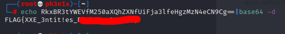

# Flag 15
They give us the following hint: **the treasure stored in flag.php**
We are presented with this page:

I tried to play with the **category** parameter during long time and the following payload got a hit: **php://filter/convert.base64-encode/resource=index**

I tried to replace "index" with "flag" but it did'nt return anything useful, so I tried a simple path traversal and it worked.

